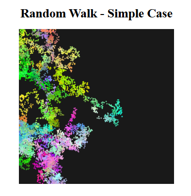

# Random Walk - Simple Case

## Preview


_Example of the random walk pattern generated by this project_

## Description

This project implements a visual simulation of a random walk algorithm using p5.js. A random walk is a mathematical object that describes a path consisting of a succession of random steps. In this visualization, a point moves randomly on a canvas while changing colors, creating an artistic pattern over time.

## Features

- Random movement in four directions (up, down, left, right)
- Dynamic color changes with smooth transitions
- Constrained movement within canvas boundaries
- Adjustable parameters for:
  - Step speed (movement rate)
  - Color change speed
  - Point size

## Technical Details

### Dependencies

- p5.js library
- p5.sound library

### Core Components

#### Walker Class

The main component is the `Walker` class which handles:

- Position tracking (x, y coordinates)
- Color management (RGB values)
- Movement logic
- Display rendering

#### Key Parameters

- Canvas Size: 400x400 pixels
- Background Color: Dark gray (25)
- Point Weight: 3 pixels
- Step Speed: 20 steps per frame
- Color Speed: 10 units per frame

### Implementation Details

#### Movement

The walker moves randomly in one of four directions:

```javascript
case 0: right (x++)
case 1: left  (x--)
case 2: down  (y++)
case 3: up    (y--)
```

#### Color Behavior

- Colors (R,G,B) change randomly within the range [-10, 10] per frame
- Values are constrained between 0 and 255
- Creates smooth color transitions during movement

## Setup Instructions

1. Clone this repository
2. Make sure you have the following file structure:
   ```
   your-project/
   ├── index.html
   ├── sketch.js
   ├── images/
   │   └── example.png
   └── libraries/
       ├── p5.min.js
       └── p5.sound.min.js
   ```
3. Open `index.html` in a web browser
   - Note: Due to browser security restrictions, you may need to run this through a local server

## Customization

You can modify several parameters in `sketch.js` to change the behavior:

- `stepSpeed`: Controls movement speed (default: 20)
- `colorSpeed`: Controls color change rate (default: 10)
- `pointWeight`: Controls size of points (default: 3)
- Canvas dimensions in `setup()` function

## Future Enhancements

Potential improvements could include:

- Adding user controls for speed and color changes
- Implementing different movement patterns
- Adding trails or fade effects
- Including multiple walkers
- Adding interactive elements

## License

This project is open source and available under the MIT License.

## Credits

Built with [p5.js](https://p5js.org/) - a JavaScript library for creative coding
